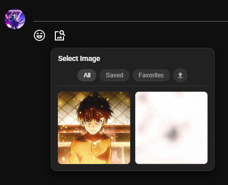
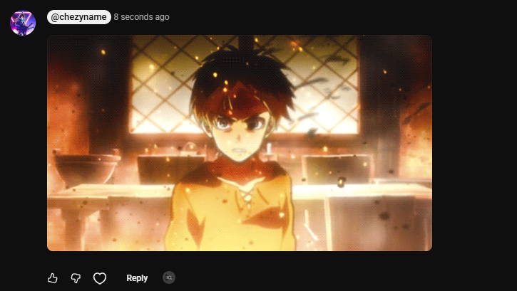
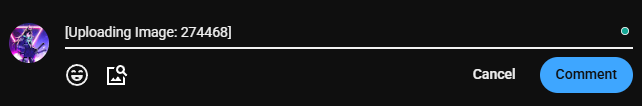
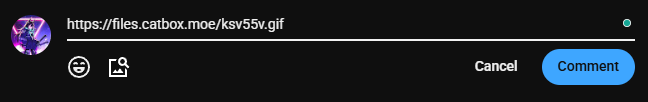
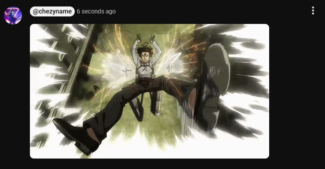

  <b>Images for YouTube</b>

  <a href="#about"> About </a> |
  <a href="#features"> Features </a> |
  <a href="#installation"> Installation </a> |
  <a href="#roadmap--future-implementations"> Roadmap </a>

---

## About
> **Disclaimer:** *Images for YouTube* is an independent open-source project. This extention and its developer(s) are not affiliated with, authorized, maintained, sponsored, or endorsed by YouTube, Google LLC, or any of their affiliates or subsidiaries. All product and company names are trademarks™ or registered® trademarks of their respective holders.

**Images for YouTube** adds a feature inspired by TikTok's comment section, stickers or images. This extention parses image urls in YouTube's comment section, allowing user expression using images rather than plain text.

**TLDR:** YouTube comments are boring and need images (mainly GIFs) to spice things up.

## Features

* **Renderer:** Added a renderer to replace all valid image URLs to actual images for your eyes to see
* **Image Selection Button:** Right next to the *Emoji* button when creating or editing a YouTube comment, is now an image search button which allows you to select an image that you have saved or uploaded, or upload your own image to `catbox.moe`, see below for privacy information.
* **Popup:** When you select the extention, it opens a pop-up that allows you to edit settings, view your saved and uploaded images, and delete images you had saved or uploaded.

> [!NOTE]
> **Data & Privacy Notice:** Local files are uploaded completely anonymously to Catbox (`catbox.moe`). Because these uploads do not require a user account or authorization tokens, files cannot be manually deleted or modified once posted to the thread.

## Installation
> If you are updating this extention, note that all your data will be wiped.  
> Additionally, an unpacked extension is a 'developer' extension meaning that you should be careful when using it, this code has not been approved by Google, so tread carefully.

This extention is currently not in the Chrome WebStore, so installation is all manual

1. Download the [Latest Release](https://github.com/ChezyName/YT-IMG/releases/latest)
> File should be `YT-IMG-vX.Y.Z.zip`

2. Unzip
> This should be a spot where the folder can stay as chrome unpacked extentions need to stay to be read from, recommended: `AppData\Local\Google\Chrome`

3. Open Extentions at [chrome://extentions](chrome://extentions/)
> Needed to load an unpacked extention (dev environment)

4. 'Load unpacked' and Select the folder `YT-IMG-vXYZ`

## How to Use
Fill in the How To Use Section w/ Images and Showcase via Videos?

### Standard Image Selection
Using the new UI allows you to nativly select images that you have as saved or favorited 

Upon clicking on an image, it pastes the URL which later is renderered such as the following  

### Uploading Images
Images are uploaded when you upload via the UI or by pasting an image (copy on your desktop and paste)

*Pre-Upload* 

*Post-Upload* 

*Viewed as Comment* 

## Roadmap & Future Implementations

Chrome WebStore [Top Priority]

Get this extention on the Chrome WebStore to allow all the features to work nicely without dealing with BS such as users losing their data when updating

Save Any Image

Allow users to favorite any image they come across

Popup Settings Refresh

Get the popup menu settings to refresh the youtube images confidently

Load Times for Images

Due to the way images are loaded, In the image search tool (when creating / editing a comment),
it can take a while for the images to load, adding an async system to load when it has time, or perhaps loading on extention load could work.

---

Images for YouTube © 2026 ChezyName

